# BookCat书籍社区
BookCat书籍社区，S2SH+BootStrap4+MySQL，J2EE课程项目。
## 小组成员
刘知昊，蔡坤，辛翌菲，李喆雯，马家俊，吴瑟晞。
## 主要界面展示

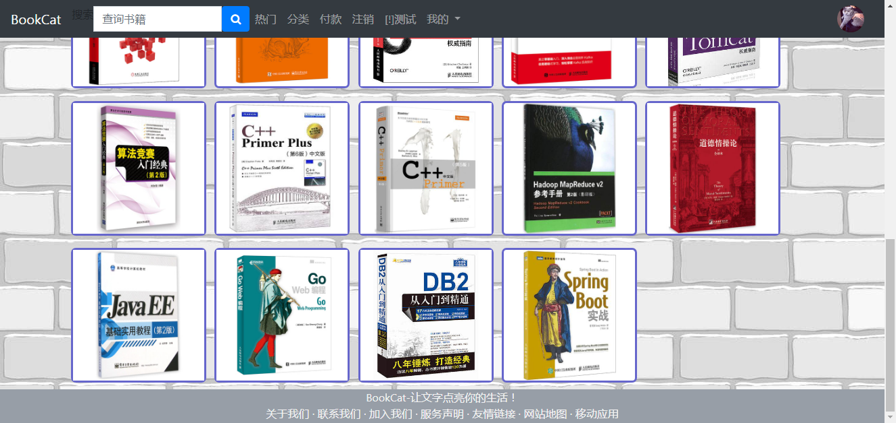

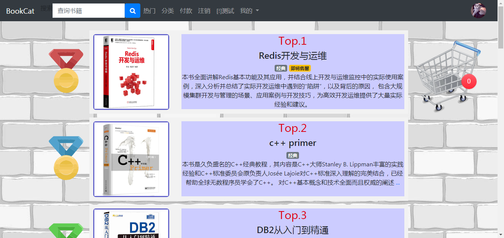

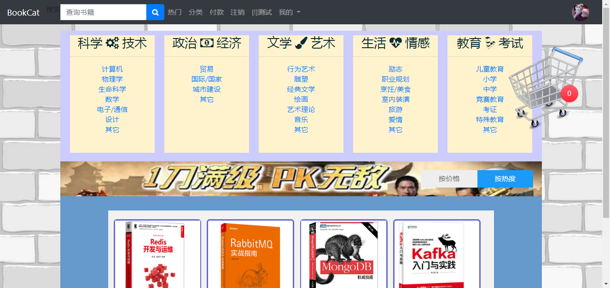

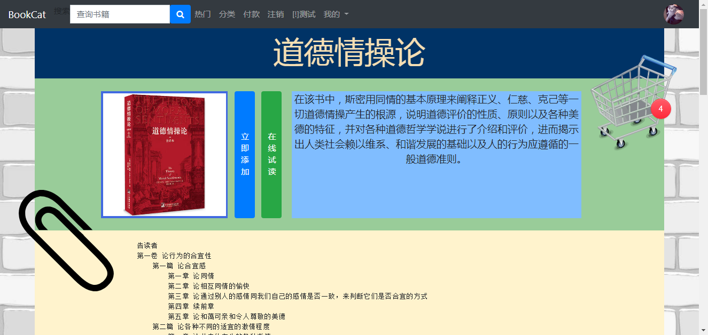

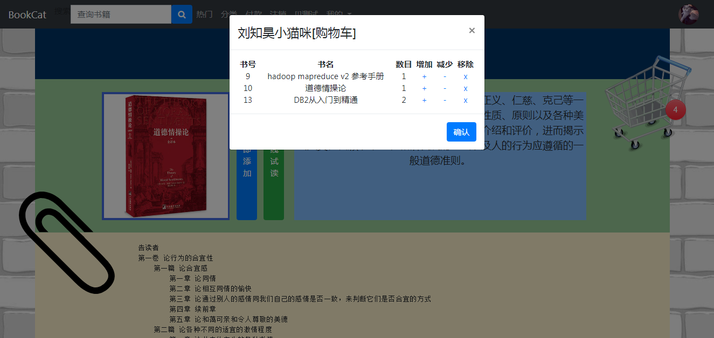

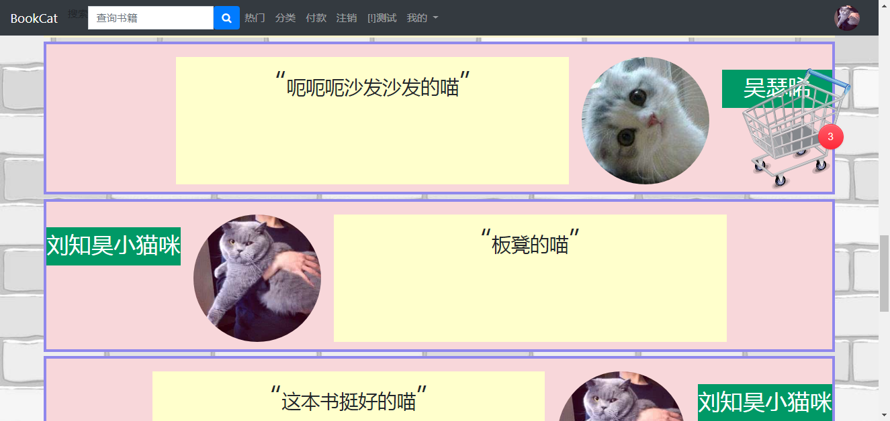

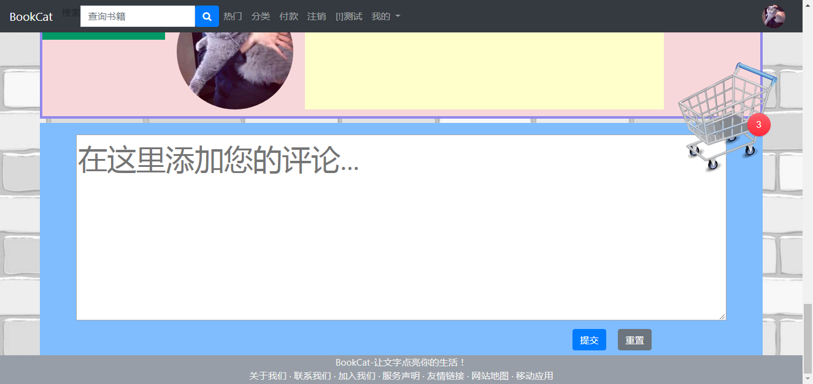

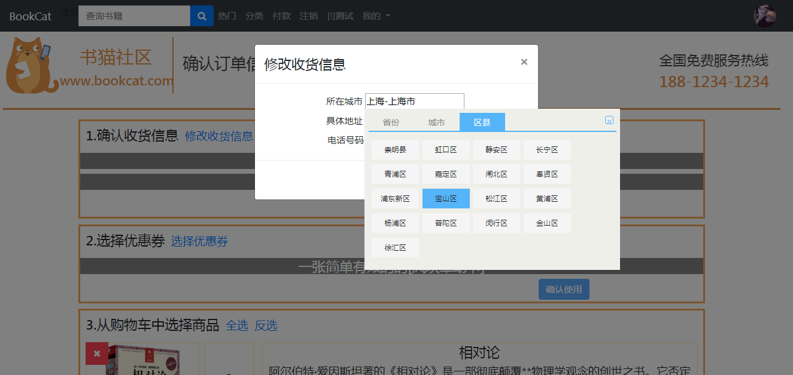

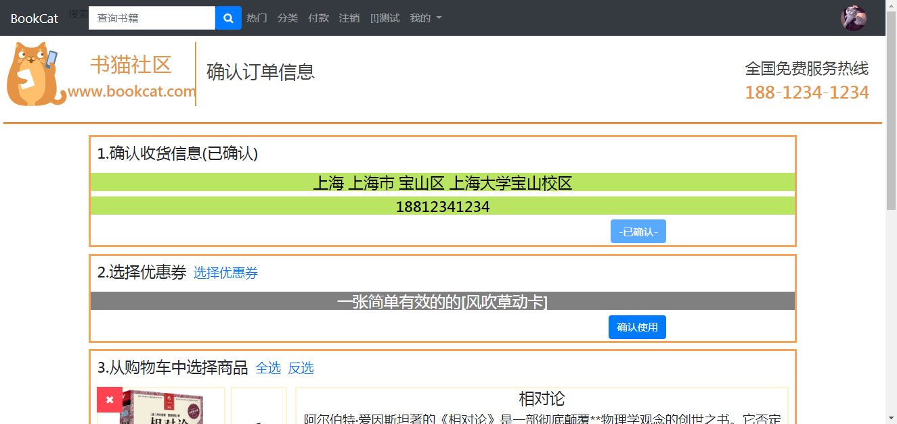

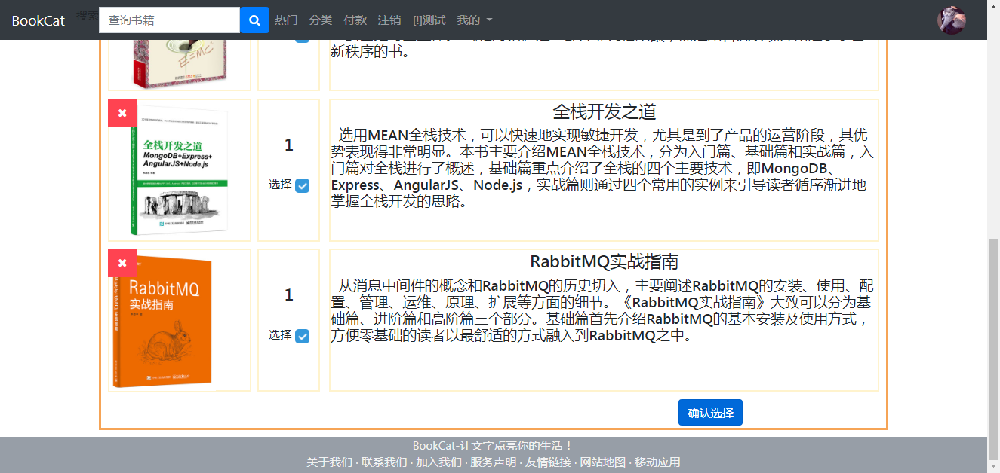

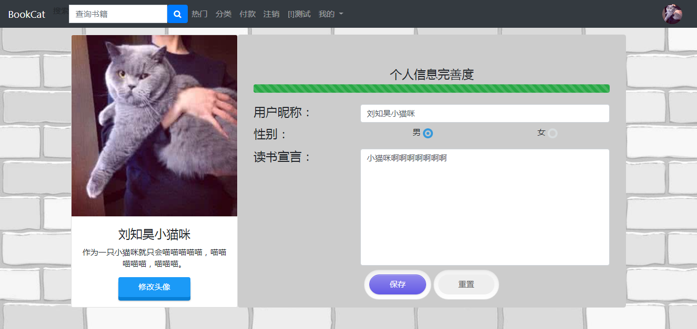

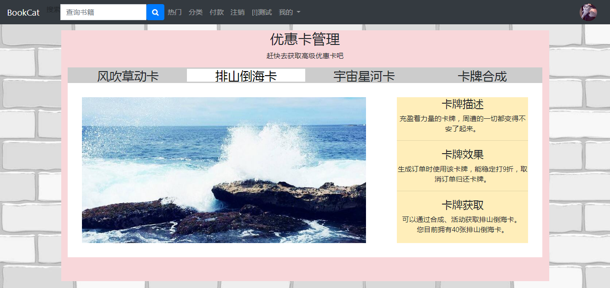

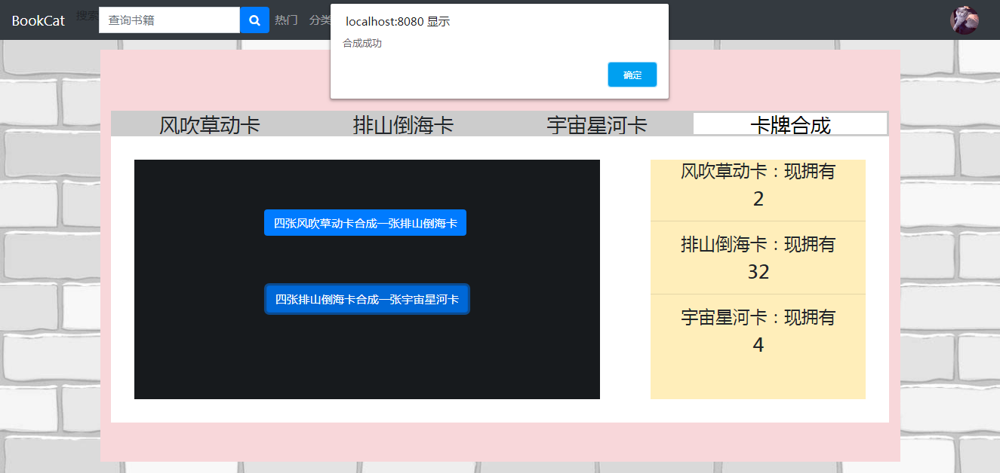

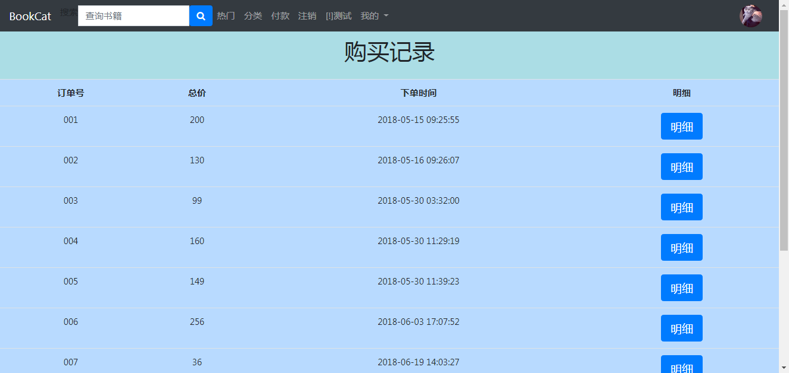

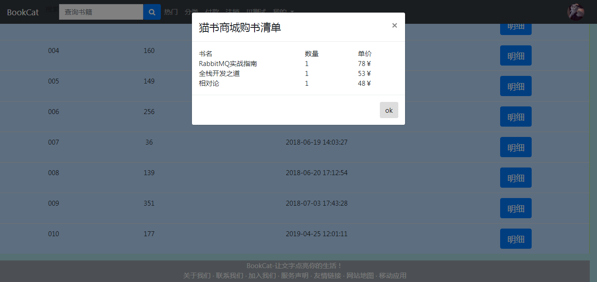

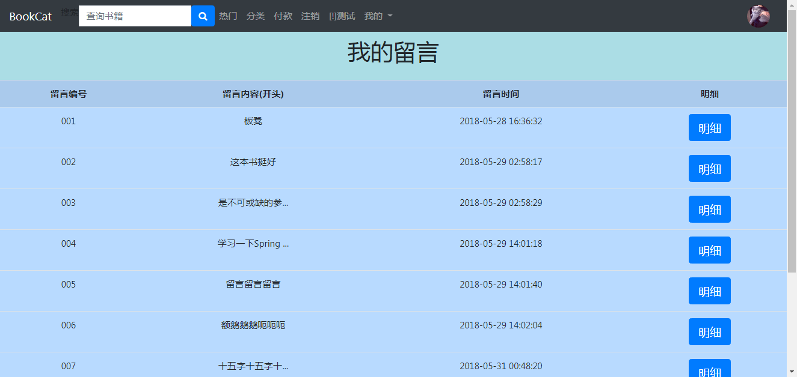

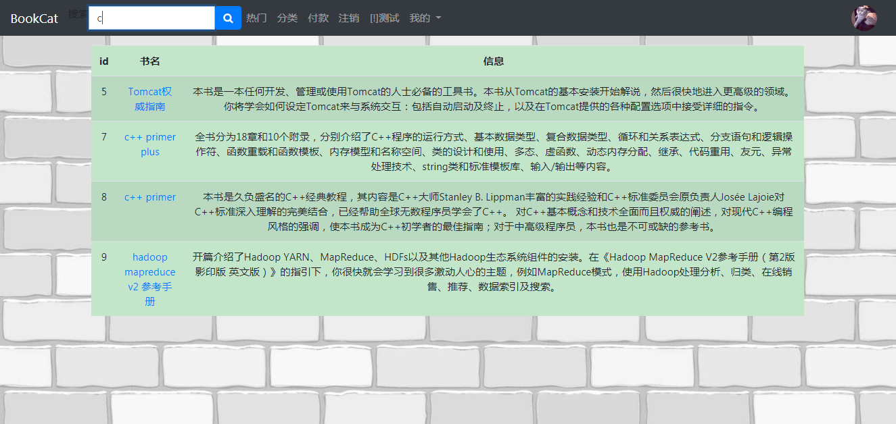

## 配置本项目
先安装好JDK1.8，Tomcat7，MySQL，IntelliJ IDEA，然后将资源备份下的数据库文件导入本地MySQL。
### 导入IDEA
打开IDEA，选择[Import Project]，选择clone好的BookCat根目录，选择[Create project from existing sources]，点击Next。

提示提示配置[Project name/location/format]，使用默认值，点击[Next]。

此时提示选择项目source file的识别目录，这里只要使用默认的状态，即勾选了BookCat下的src目录即可，点击[Next]。

此时提示检查所查找到的库，在左边可以看到唯一的lib已经勾选，点击[Next]。

此时提示检查模块依赖，点击[Next]。

此时提示选择SDK，请选择已经下载好的JDK1.8，如果还未配置，可以点击左侧的绿色[+]添加，注意[JDK home path]选择JDK所在的目录，如我的是[E:\Program Files\jdk1.8.0_162]，点击[Next]。

此时提示检查Web.xml，已经检测出来并勾选好了，点击[Finish]。
### 项目结构配置
导入项目后，在左侧栏的[1.Project]可以看到项目的目录结构。点击项目的根目录[BookCat]，按下[F4]，可以打开[Project Structure]配置。

选择左侧的[Facets]栏目，可以看到下方的警告['Web' Facets resources are not included in an artifact]，直接点击右侧的按钮[Create Artifact]即可。

选择左侧的[Problems]栏目，可以看到[Artifact BookCat:Web exploded: library 'lib' required for module 'BookCat' is missing from the artifact [Fix]]，点击[Fix]，选择[Add lib to the artifact]即可。

选择左侧的[Modules]栏目，右键选择[Web]，选择[+ Add]，选择下方的[Struts 2]，勾选项目中的[struts.xml]即可。

选择左侧的[Library]栏目，点击绿色[+]，在弹出的[Select Library Files]中选择已经安装好的Tomcat目录下lib子目录下的servlet-api.jar文件，点击[OK]，提示[Choose Modules]，选择[BookCat]并点击[OK]。

点击[OK]保存并关闭[Project Structure]配置。

在项目中打开[BookCat/web/WEB-INF/applicationContext.xml]文件，可以看到上方的提示信息[Application context not configure for this file]，直接点击其右侧蓝色的[Create Spring facet]，此时将自动打开[Project Structure]配置，并进入到Modules配置，在此配置下自动加入了Spring的配置，点击右侧的绿色[+]以打开[New Application Context]，选择[applicationContext.xml]文件，点击[OK]，再点击[OK]保存并关闭[Project Structure]配置。
### Tomcat配置
点击上方小的运行下拉栏，选择[Edit Configurations...]以打开[Run/Debug Configuration]。点击左上角的绿色[+]，选择[Tomcat Server]下的[Local]以建立一个Tomcat运行配置，在右侧可以修改配置，不妨先将其[Name]从Unnamed改为BookCat_Tomcat，这只是一种强迫症的做法，提示我们这是"从Tomcat运行BookCat"项目。

首先，在[Server]选项卡下，看到最下方警告[Warning: No artifacts marked for deployment]，直接点击右侧的[Fix]，此时将自动跳转到[Deployment]选项卡下，并自动创建了一个[BookCat:Web exploded]。

在[Deployment]选项卡下，点击中间的绿色[+]，选择[Externel Source..]，选择[BookCat/web/WEB-PIC]目录，点击[OK]。选中刚刚添加的WEB-PIC，在右侧将其[Application context]从默认的[/]修改为[/pic]。
### 路径配置
在项目中打开[BookCat/src/org/tools/ConstObj]，该Class下用绝对路径指向了资源目录，修改成自己电脑上的绝对路径。
### 数据库配置
在项目中打开[BookCat/web/WEB-INF/applicationContext.xml]文件，在此文件中配置MySQL数据库端口、数据库名、用户名、密码等信息。

## 运行本项目
在IDEA中上方运行栏可见刚刚配置的[BookCat_Tomcat]，点击旁边的绿色三角即可运行。运行后可以使用用户名[刘知昊小猫咪]和密码[123456]登录到BookCat社区中。

## 其它问题(请反馈)
【1】匿名内部类使用非final外部变量的问题，需在IDEA中将Language Level设置成8。

## 开发与合作日志
### 2018年5月19日
【1】请大家尽量规范编程，特别是类、接口、变量、函数、形参的命名，多写注释；尽量让自己的模块不与其它部分耦合。
 
【2】数据库已经转储至"./资源备份/"目录下的bookcatdb.sql文件中，可以使用Navicat直接导入至MySQL。
 
【3】为了实现功能，缺少的数据请大家自己填补，并在最后转储且替换掉之前的"bookcatdb.sql"。
 
【4】进入IDEA配置Tomcat服务器时，在Run/Debug Configuration栏目配置好后，在右侧Deployment选项卡下的Application context处设定项目的根目录为"/"。
 
【5】启动时提示的log4j:WARN请先忽略。
 
【6】IDEA环境下Tomcat的默认报错信息保存在".IntelliJIdea\system\tomcat\Unnamed_CSCat\logs"下，也可以在网上找教程配置到显示在控制台中。
 
【7】DAO层(如果用到)、Service层必须提供接口，其实现类去实现接口中的方法(默认为public abstract)。
 
【8】Action的创建已经转交给Spring框架，应在web/WEB-INF/applicationContext.xml中配置其实现类bean，并注入相应的(注入了DAO的bean的)Service的bean。
 
【9】公用的错误页面为web/other/failed.jsp
### 2018年5月26日
【1】导航栏、footer元素、购物车已经完全解耦。
 
【2】付款页面的样式和动作已经完成。
 
【3】现在可以从[主页]和[热门]页面直接点击书的图片进入书籍详细信息页。
 
【4】数据库中，留言表请增加一个主属性time，相关xml映射和PK实体类已经上传。
### 2018年6月3日
版本留存。
注意配置Tomcat虚拟路径，这在IDEA下可以直接配置。
### 2018年7月3日
近期从Gitee迁移到GitHub，提供本README文件中的界面展示。
### 2019年4月25日
【1】在README中更新了详细的项目配置流程。
 
【2】更新README图片到项目内[README_PIC]下。
 
【3】"有字库"cdn已经失效，如有需要自行修改！见[BookCat\web\sharing\extern.jsp]和使用处的样式表文件。

